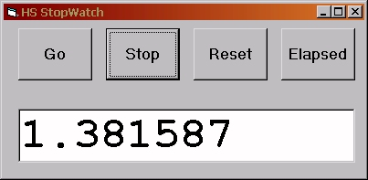

<div align="center">

## High Speed Timer


</div>

### Description

High Speed Timer class with 3 sample programs to illustrate usage!

1) Time execution of your code.

2) Simple Game to test your reaction time.

3) Fully functional high-precision stopwatch.

The High Speed Timer class is fully independent and ready to be

added to other proggies. Also shows usage of LARGE INTEGER (8 bytes),

demonstrates a few API calls, all wrapped up in a neat little package.

Please vote if you think it's worth it :<|
 
### More Info
 
This little class will be very useful for making games, utilities and debugging your own code. Please give me feedback & VOTE!


<span>             |<span>
---                |---
**Submitted On**   |2002-10-22 09:03:42
**By**             |[the Mussel](https://github.com/Planet-Source-Code/PSCIndex/blob/master/ByAuthor/the-mussel.md)
**Level**          |Intermediate
**User Rating**    |4.5 (18 globes from 4 users)
**Compatibility**  |VB 4\.0 \(32\-bit\), VB 5\.0, VB 6\.0
**Category**       |[VB function enhancement](https://github.com/Planet-Source-Code/PSCIndex/blob/master/ByCategory/vb-function-enhancement__1-25.md)
**World**          |[Visual Basic](https://github.com/Planet-Source-Code/PSCIndex/blob/master/ByWorld/visual-basic.md)
**Archive File**   |[High\_Speed14853810222002\.zip](https://github.com/Planet-Source-Code/the-mussel-high-speed-timer__1-40053/archive/master.zip)

### API Declarations

```
'Function to get current clock count
Private Declare Function QueryPerformanceCounter Lib "kernel32" ( _
 lpPerformanceCount As Currency) As Long
'Function to see how many clock ticks per second on this computer
Private Declare Function QueryPerformanceFrequency Lib "kernel32" ( _
 lpPerformanceCount As Currency) As Long
```


